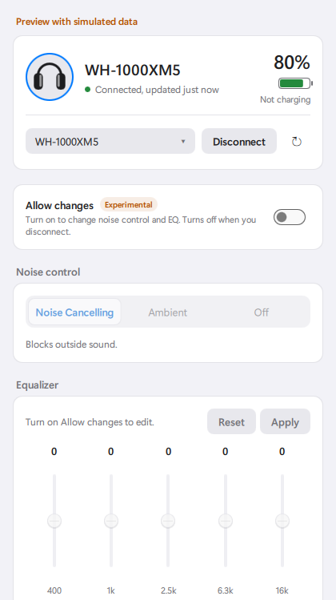
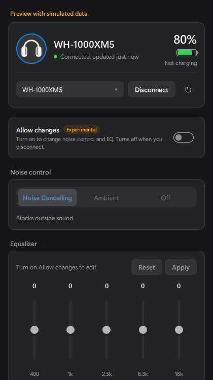

# Headset Desk

A Windows 11 desktop app for **Sony WH-1000XM5** and **WH-CH720N**: battery and firmware, noise control, five-band EQ and Clear Bass, with a system tray.

[](https://github.com/ashwinpr15/headset-desk/actions/workflows/desktop-release.yml) [](https://github.com/ashwinpr15/headset-desk/actions/workflows/windows.yml)

## Download for Windows

**[Download Windows installer](https://github.com/ashwinpr15/headset-desk/releases/download/v0.4.0-beta.1/headset-desk-v0.4.0-beta.1-windows-x64-setup.exe)**

[Portable ZIP](https://github.com/ashwinpr15/headset-desk/releases/download/v0.4.0-beta.1/headset-desk-v0.4.0-beta.1-windows-x64.zip) · [All versions and release notes](https://github.com/ashwinpr15/headset-desk/releases) · [Report an issue](https://github.com/ashwinpr15/headset-desk/issues)

Current version: **0.4.0-beta.1**. Windows 11, x64. The installer bundles the app and runtime, creates a Start menu shortcut, and supports uninstalling through Windows Settings. It installs for your Windows account without administrator rights. No Qt installation, developer tools, sign-in or internet connection is needed to run the installed app.

This is an **experimental beta**. Reads are verified on the devices listed below. Changing settings is an opt-in: turn on **Allow changes** for each connection. The owner has used noise control on a WH-1000XM5 with the 0.3.0 beta, but writes are not yet verified across firmware or units.

The app and installer are unsigned; Windows SmartScreen may warn about an unrecognized app. Download from this repository's Releases; `CHECKSUMS.txt` accompanies the assets. No firmware updates or power commands are offered.

## Install and use

1. Download the installer, run it, then open **Headset Desk** from Start. Alternatively, extract the **entire** portable ZIP and open `headset-desk.exe` inside its folder.
2. Pair your headset in Windows Bluetooth settings and turn it on. Close other headset-control tools. The app connects automatically when Windows reports a supported paired headset as active; otherwise choose **Connect**.
3. Check the readings. To change settings, turn on **Allow changes**. Pick Noise Cancelling, Ambient or Off; Ambient has a level from 1 to 20. Drag the five EQ bands and Clear Bass, then choose **Apply**. **Reset** discards edits you haven't applied.

Every change is sent once and confirmed by reading it back. A timeout, disconnection or mismatch turns changes off and says what happened; nothing is replayed. Disconnecting, switching headsets or reconnecting turns **Allow changes** off again.

## The app

Screenshots from the released Windows build, using **simulated data**:

 

- Model, battery with a gauge, charging state, firmware and headset-reported codec. Unknown values show a dash, never a made-up number.
- Noise Cancelling / Ambient / Off as one segmented control; Ambient level 1–20. The headphone drawing shows the current mode.
- Five EQ bands (400 Hz, 1 kHz, 2.5 kHz, 6.3 kHz, 16 kHz) and Clear Bass, −10 to +10, filled from 0 dB.
- Light and dark appearance that follows Windows, resizable window, native tray, keyboard focus rings. Motion stops when Windows "Animation effects" is off.
- Close hides to the tray and keeps the connection. Tray **Quit** exits. Launching a second copy brings the first forward.
- Refresh on connection, on reopening and on demand, plus a slow battery check. One headset at a time.
- No cloud account, analytics, internet updater, Windows service or launch at sign-in.

## Device evidence

| Model | Physical read evidence | Noise / EQ writes |
|---|---|---|
| WH-1000XM5 | Firmware 2.5.1; battery 44%, charging false, reported AAC, Off, one EQ state | Opt-in. Owner observed Off → NC → Ambient 1 → Off confirmed by readback (0.3.0); confidence in code still **UNKNOWN** |
| WH-CH720N | Firmware 1.1.4; battery 99%, charging false, reported AAC, Off, one EQ state | Opt-in. Owner reports it working (0.3.0), not itemised; confidence in code still **UNKNOWN** |

Read evidence covers those captured states only. Charging true, NC/Ambient reads, other firmware, EQ presets/endpoints, GUI operation on hardware and long-session/reconnect behavior still need physical testing. The Off replies differ; successful reads do not establish interchangeable write behavior. Model identity comes from Windows' cached pairing name. The codec is reported by the headset, not measured from Windows audio. Renamed and other models are excluded.

[Hardware captures and limits](docs/hardware-validation.md) · [CH720N evidence](docs/wh-ch720n-validation.md) · [Beta validation](docs/desktop-validation.md) · [Architecture](docs/architecture.md)

## Build from source

Use C++20, CMake 3.25+, Ninja, Qt **6.8.3** `mingw_64`, and its matching MinGW **GCC 13.1.0** kit. Put compiler and Qt `bin` directories on PATH.

```powershell
cmake -S . -B build-desktop -G Ninja -DCMAKE_BUILD_TYPE=Release -DHEADSET_DESK_BUILD_DESKTOP=ON -DCMAKE_PREFIX_PATH=C:/Qt/6.8.3/mingw_64
cmake --build build-desktop --parallel 4
ctest --test-dir build-desktop --output-on-failure
```

[Build, deploy and package](docs/desktop-build.md). Default CMake builds the core and internal read-only diagnostics without Qt; the CLI is a development tool, not the consumer app. [Diagnostic instructions](docs/hardware-validation.md). GitHub Actions builds the desktop app with the release kit, runs every offline test, checks the bundled runtime, and installs, verifies and uninstalls the installer on each change; [details](docs/desktop-build.md#automated-builds).

## Credits and license

Based on protocol and Windows transport from [marconvcm/sony-device-center](https://github.com/marconvcm/sony-device-center). Imported files retain upstream MIT notices; [attribution and changes](docs/attribution.md). New Headset Desk code is [MIT licensed](LICENSE).

Qt 6.8.3 is dynamically linked under LGPLv3. Downloads include Qt and other runtime notices. Exact corresponding Qt sources are supplied as a companion release asset; application source is also available. Replacing compatible Qt DLLs/plugins and reverse engineering to debug those replacements is permitted. Preserve notices and source availability when redistributing.

Headset Desk is independent and not affiliated with Sony. No Sony artwork is included.
