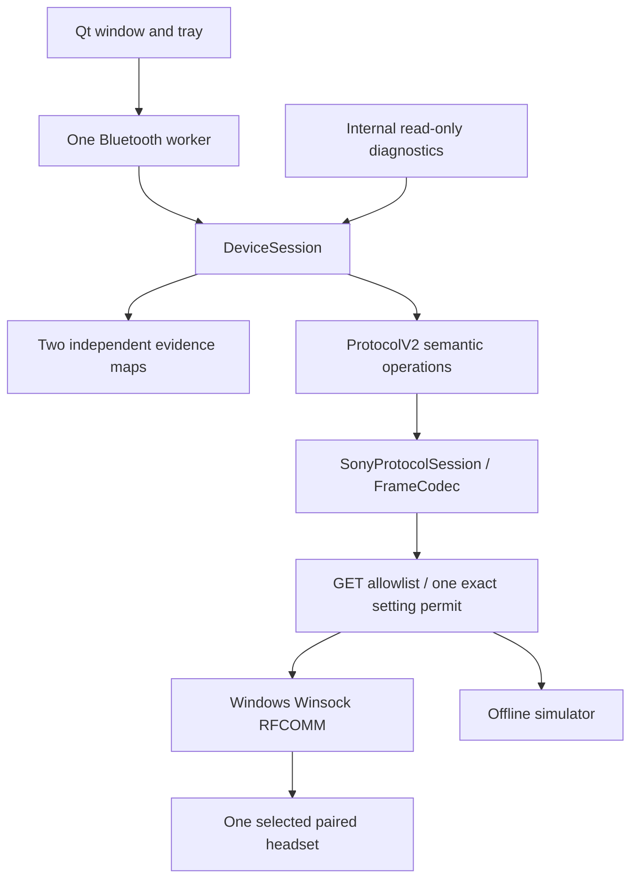

# Application architecture

DeviceSession serializes operations and returns state copies under a separate lock. Bluetooth runs on one Qt worker; UI stays on the main thread. The imported protocol reader owns framing, sequence handling and notification ACKs. Disconnect/loss clears telemetry and experimental opt-in. Unknown values never become zero or false.

Known paired model names and a confirmed V2 service are required before queries. V1 is unreachable from this core. `22` has different generation-specific meanings; a V1 link closes before querying. V2 UUID: `956C7B26-D49A-4BA8-B03F-B17D393CB6E2`; V1: `96CC203E-5068-46AD-B32D-E316F5E069BA`. Executable upstream constants take precedence over conflicting UUIDs in the uploaded README.

| Operation | GET | Return |
|---|---|---|
| Initialize | `00 00` | `01` |
| Battery/charging | `22 00` | `23 00` |
| Firmware | `04 02` | `05 02` |
| Reported codec | `12 02` | `13 02` |
| Noise | `66 17` | `67 17` |
| Five-band EQ/Clear Bass | `56 00` | `57 00` |

Only those GETs and empty ACKs cross the transport by default. Diagnostics cannot grant setting access. Imported setters called directly remain blocked. Core settings require a live model, refreshed firmware/noise/EQ, and explicit per-connection experimental opt-in. This never changes hardware confidence.

The core validates noise mode, Ambient 1–20, exactly five EQ bands and Clear Bass −10..+10. It grants one exact payload permit, consumed before sending. Noise uses the upstream `68 17 01 effect type voice level`; custom EQ uses `58 00 A0 06 bass+10 band1+10 ... band5+10`. No power, firmware update, arbitrary packet, preset, ten-band, earbud or unknown-model command is permitted.

Settings wait for ACK, then read the actual value up to three times, 100 ms between mismatches. These reads do not resend the setting. Semantic equality is required; ACK alone is insufficient. Failure revokes permits, disables controls and refreshes actual readings. No automatic rollback, setting retry or reconnect replay. Hardware write confidence remains UNKNOWN on both models.

Native connect/send are bounded to eight seconds; receive to 2.5 seconds. Reconnect has at most five attempts, delays 1,2,4,8,16 seconds, without enabling controls. Disconnect/switch/Quit cancels it. Close hides to tray; Quit disconnects and joins the worker. The local per-user single-instance pipe accepts only OPEN. A named Windows mutex prevents install/uninstall while the production app is running.

Full reads occur on connect/reopen/request; battery refresh every three minutes. Unclassified C9 notifications do not drive telemetry. QSettings stores only the preferred real device. No startup, cloud, service or analytics components. Physical fixtures establish observed reads only; offline simulation cannot verify headset write compatibility.
