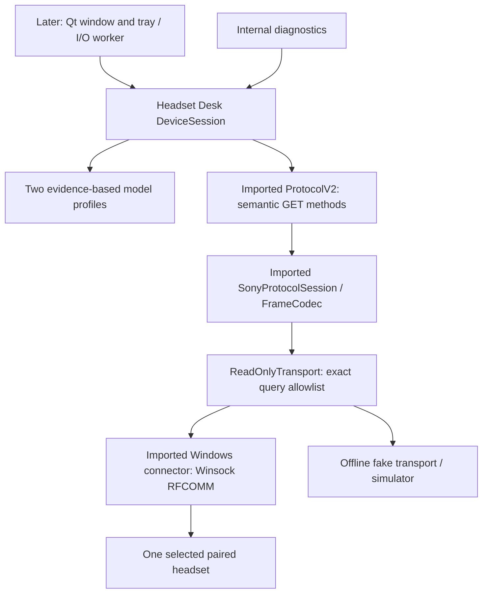

# Phase 2 architecture

`DeviceSession` serializes connect, refresh and disconnect with an operation mutex. `state()` returns a copy using a separate state mutex; the future GUI can observe Connecting without blocking on I/O. Imported `SonyProtocolSession` owns the reader thread. State is cleared on a new connection or disconnect; refresh failures replace the affected field with Unknown rather than keeping a stale value marked Known.

The core has no setter or raw command API. Imported V1 and V2 serializers remain separate and their tests are retained. V1 is not reachable from the Headset Desk core. Known paired-name selection and successful V2 service selection are both required before queries. The final transport guard allows only an empty protocol ACK or an exact two-byte reviewed V2 query. It validates complete frames before delegating partial socket sends.

Allowed query payloads, sourced from imported `ProtocolV2.cpp`:

| Semantic operation | V2 payload | Matching response |
|---|---|---|
| Read initialization | `00 00` | `01` |
| Main battery/charging | `22 00` | `23 00` |
| Firmware | `04 02` | `05 02` |
| Reported active codec | `12 02` | `13 02` |
| Noise state | `66 17` | `67 17` |
| Five-band EQ/Clear Bass | `56 00` | `57 00` |

The **meaning of `22` is generation-specific**: it is not a safe battery query on V1. The guard closes a V1 service connection before any Sony query is sent. It also rejects earbud battery subtypes and ten-band EQ queries. Only these two over-ear models are in the Phase 2 application map.

Service UUIDs follow executable upstream constants and its architecture document:

- V1: `96CC203E-5068-46AD-B32D-E316F5E069BA`
- V2: `956C7B26-D49A-4BA8-B03F-B17D393CB6E2`

The uploaded root README has conflicting UUIDs; those values are not used. Headset Desk explicitly requests the V2 service for its two known models. The generic imported connector retains V1-then-V2 fallback for its upstream API, but the Headset Desk factory never uses that fallback. Connect is bounded to eight seconds, send to eight seconds, receive to 2.5 seconds. Successful native Windows read sessions are recorded for both models in the hardware validation document; failure/deadline and reconnect edge cases still need physical testing.

No daemon or Windows service is needed in v1. The future GUI process will own the persistent connection. The internal CLI must be run with the GUI closed. Close-to-tray and Quit are GUI work in a later phase; Phase 2 does not register startup entries or use the tray.

The imported ACK/alternating-sequence behavior is retained for the read-only baseline. Both reviewed captures contain answered GETs and empty ACKs, with no retries or timeouts. Capture replay covers the original response sequences and the two unclassified XM5 notifications. Before enabling setters, review write-specific acknowledgment and failure behavior. The read path completes on the matched data response. There is no new retransmission policy and no claim that offline simulation verifies hardware ARQ.
